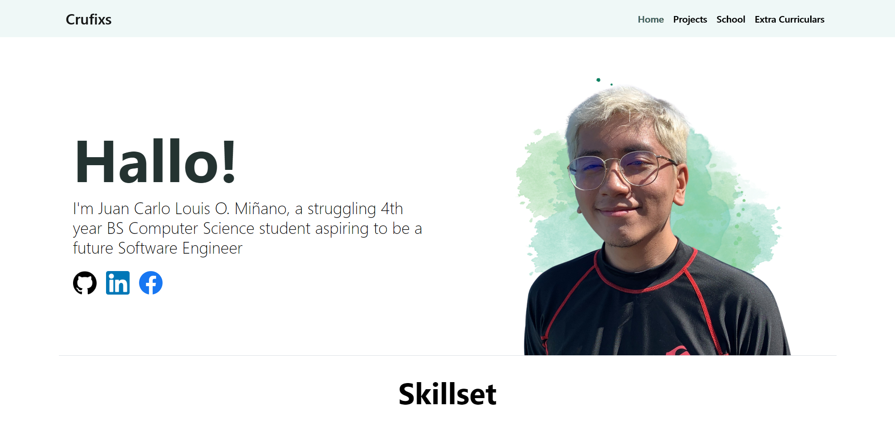
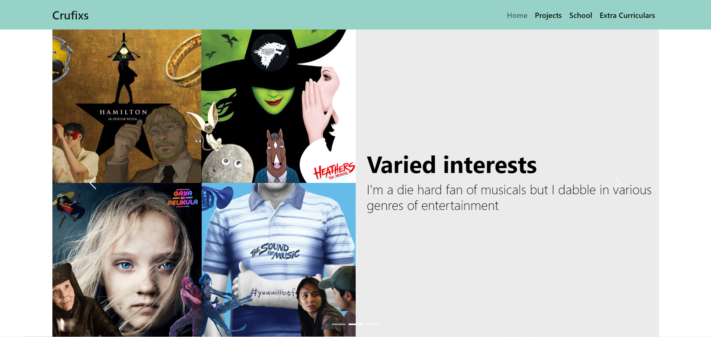
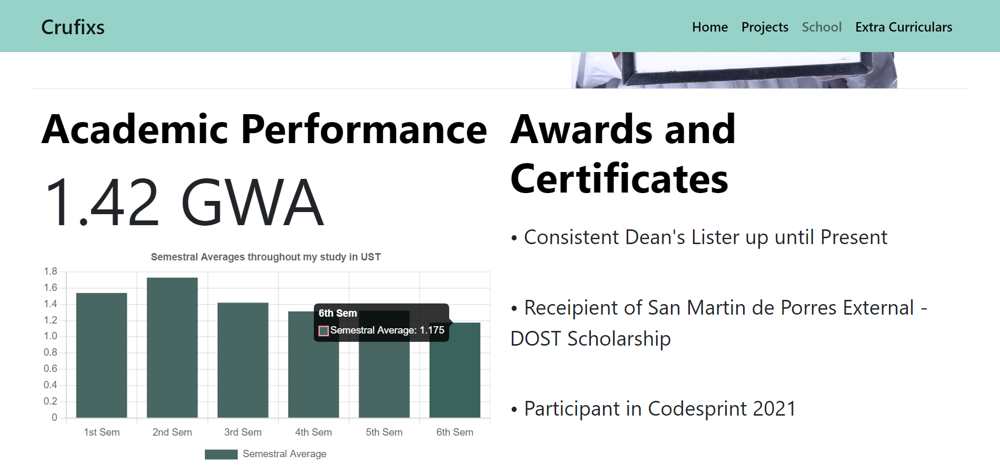

# Portfolio Website

<!--
https://crufixs.herokuapp.com/
-->

This project is my personal portfolio showcasing my personal interests, projects, academic works, and extra-curricular activities. I made this to showcase my knowledge in ReactJS and Bootstrap. Some of the screenshots that can be found in the website are as follows:

## Screenshots

## Installation

In order to run the website, clone the project from the github repository and then run the following line in the project directory using the command line prompt

### `npm build`

Running this will install the projects dependencies. After the installation the website can be launched by typing the following in the command line prompt

### `npm start`
